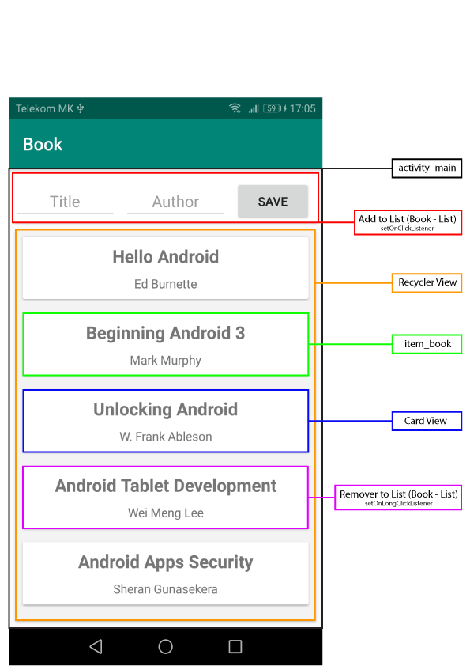

# Android_Book-List
Add-Remover Item from List (BookList)

## Description

  ### 1. Usaged
   - Card View
   - Recycler View

  ### 2. Add dependency 
   build.gradle.(Module: app)
    
    dependencies {
        
      // Recycler View
      implementation 'com.android.support:recyclerview-v7:28.0.0'
      
      // Card View
      implementation 'com.android.support:cardview-v7:28.0.0'
      
      
  ### 3. Create:                          

   **Package / Class:**
   - **adapter (Package)**
      - BookAdapter.class
   - **model (Package)**
      - BookModel.class
      
   - MainActivity.class   
   
  **layout:**
   - activity_main.xml
   - item_book.xml   
 
  ### 4.Concept:
  

### 4.Demo:

## Author: Nikola Petkovik
  ### contact:
   - Gmail: nikolapetkovik86@gmail.com
   
